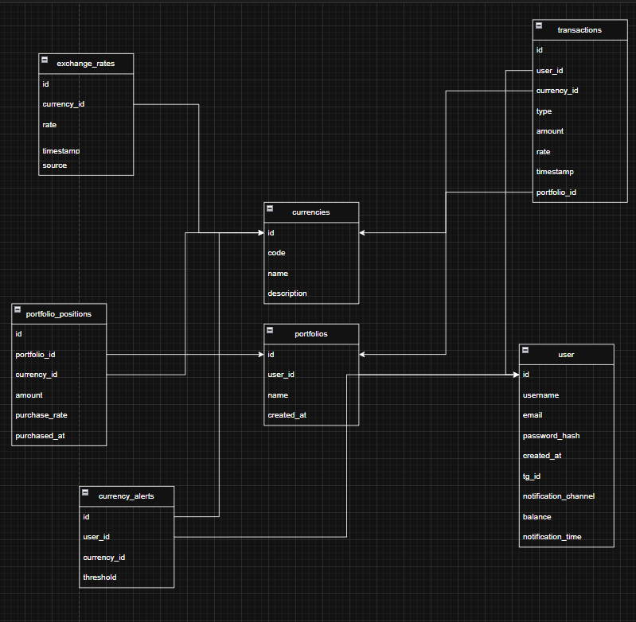

# Currency Portfolio Management System

## Участники проекта:
** **
- Самофалов Роман - Teamlead , fullstack
- Храмов Никита - frontend
- Назаров Егор- frontend
- Антошкин Лука 

   

## Описание проекта

Целью проекта является разработка веб-приложения для анализа валютного рынка и управления валютным портфелем в реальном времени. Приложение предоставляет пользователям удобные инструменты для мониторинга курсов валют, анализа данных, управления портфелем и получения уведомлений.

## Задачи проекта

### Базовая функциональность
1. **Управление аккаунтом**:
   - Регистрация и вход в систему с использованием имени пользователя и пароля (с хешированием для безопасности).
2. **Основной функционал**:
   - Парсинг данных с сайтов (например, Московская биржа, Bitcoin) для получения актуальных данных о валютных курсах (доллар, евро, юань, биткоин).
   - Визуализация графиков изменения курсов валют за определённый период с отображением:
     - Медианы
     - Выбросов
     - Среднего значения
   - Автоматическое обновление данных каждые 5 минут.
3. **Информация о валютах**:
   - Отображение списка доступных валют с краткой справкой о каждой.

### Расширенный функционал
1. **Фильтрация и интерфейс**:
   - Возможность изменения цветовых схем графиков (включая поддержку для дальтоников).
   - Выбор временного интервала для отображения данных (1 час, 1 день, 1 месяц, 1 год).
2. **Работа с портфелями**:
   - Начальный баланс пользователя: 10,000 у.е.
   - Возможность покупки валют для формирования портфеля.
   - Отображение состава и стоимости портфеля, с уведомлением об ошибке при превышении баланса.
3. **Уведомления**:
   - Настройка уведомлений в Telegram/почте с ежедневным сообщением о стоимости выбранных валют.

### Полноценная интеграция
1. **Расширенный функционал портфеля**:
   - Возможность продавать валюту.
   - Отображение изменения стоимости портфеля в реальном времени.
   - Уведомления о росте/падении стоимости портфеля более чем на заданный порог.

## Архитектура базы данных

Проект использует следующую структуру базы данных:



Основные таблицы:
- **users**: Управление пользователями (учётные записи, баланс, настройки уведомлений).
- **currencies**: Список валют и их описания.
- **exchange_rates**: История курсов валют.
- **portfolios**: Управление пользовательскими портфелями.
- **portfolio_positions**: Хранение информации о составе портфеля.
- **transactions**: Логирование операций покупки и продажи валют.
- **currency_alerts**: Настройки уведомлений о курсах валют.

## Установка и запуск

1. **Клонирование репозитория**:
   ```bash
   git clone https://github.com/meindokuse/dashboard.git
   cd project-directory
   ```

2. **Установка зависимостей**:
   ```bash
   pip install -r requirements.txt
   ```

3. **Настройка базы данных**:
   - Импортируйте структуру базы данных из предоставленного SQL-скрипта.

4. **Запуск приложения**:
   ```bash
   python manage.py runserver
   ```

## Технологии
- Backend: Python (FastAPI)
- Frontend: React.js
- База данных: PostgreSQL, Redis
- Парсинг данных: Beautiful Soup, Scrapy
- Уведомления: Telegram Bot API, SMTP


